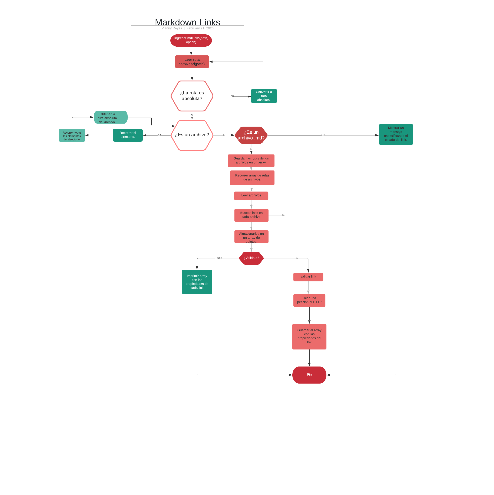

# Markdown Links

## Índice

* [1. Preámbulo](#1-preámbulo)
* [2. Objetivo](#2-Objetivo)
* [3. Objetivos de aprendizaje](#3-objetivos-de-aprendizaje)
* [4. Consideraciones generales](#4-consideraciones-generales)
* [5. Diagrama de flujo](#5-diagrama de flujo)
* [6.  Documentación técnica de la librería](#6-documentación técnica de la librería)
* [7. Guía de instalación y uso de la librería](#7-Guía de instalación y uso de la librería)


***

## 1. Preámbulo

[Markdown](https://es.wikipedia.org/wiki/Markdown) es un lenguaje de marcado
ligero muy popular entre developers. Es usado en muchísimas plataformas que
manejan texto plano (GitHub, foros, blogs, ...), y es muy común
encontrar varios archivos en ese formato en cualquier tipo de repositorio
(empezando por el tradicional `README.md`).

Estos archivos `Markdown` normalmente contienen _links_ (vínculos/ligas) que
muchas veces están rotos o ya no son válidos y eso perjudica mucho el valor de
la información que se quiere compartir.

Dentro de una comunidad de código abierto, nos han propuesto crear una
herramienta usando [Node.js](https://nodejs.org/), que lea y analice archivos
en formato `Markdown`, para verificar los links que contengan y reportar
algunas estadísticas.


## 2. Objetivo

El objetivo de este proyecto es aprender a crear nuestra propia librería (o biblioteca - library) en JavaScript.

## 3. Objetivos de aprendizaje

Diseñar tu propia librería es una experiencia fundamental para cualquier
desarrollador porque que te obliga a pensar en la interfaz (API) de tus
_módulos_ y cómo será usado por otros developers. Debes tener especial
consideración en peculiaridades del lenguaje, convenciones y buenas prácticas.

A continuación puedes ver los objetivos de aprendizaje de este proyecto:

### Javascript

* [ ] Uso de callbacks
* [ ] Consumo de Promesas
* [ ] Creacion de Promesas
* [ ] Modulos de JS (CommonJS vs ES Modules)
* [ ] Recursión

### Node

* [ ] Sistema de archivos ([fs](https://nodejs.org/api/fs.html), [path](https://nodejs.org/api/path.html))
* [ ] [package.json](https://docs.npmjs.com/files/package.json)
* [ ] crear módulos [(CommonJS)](https://nodejs.org/docs/latest-v0.10.x/api/modules.html)
* [ ] Instalar y usar módulos ([npm](https://www.npmjs.com/))
* [ ] [npm-scripts](https://docs.npmjs.com/misc/scripts)
* [ ] CLI (Command Line Interface - Interfaz de Línea de Comando)
* [ ] [http.get](https://nodejs.org/api/http.html#http_http_get_options_callback)

### Testing

* [ ] Testeo de tus funciones
* [ ] Testeo asíncrono
* [ ] Uso de librerias de Mock
* [ ] Mocks manuales
* [ ] Testeo para multiples Sistemas Operativos

### Git y Github

* [ ] Organización en Github

### Buenas prácticas de desarrollo

* [ ] Modularización
* [ ] Nomenclatura / Semántica
* [ ] Linting

***

## 4. Consideraciones generales

* La librería está implementada en JavaScript para ser ejecutada con Node.js.
* El módulo es instalable desde npm install montezakarim/md-links.
* Los tests unitarios: Jest para tus pruebas unitarias.

## 5. Diagrama de flujo


## 6. Documentación técnica de la librería

El objetivo de esta librería es validar los links encontrados en un archivo o archivos .md y obtener estadísticas de los mismos. Estose logro por medio de la siguiente implementación::

#### `mdLinks(path, options)`

##### Argumentos

* `path`: Ruta absoluta o relativa al archivo o directorio. Si la ruta pasada es
  relativa, debe resolverse como relativa al directorio desde donde se invoca
  node - _current working directory_).
* `options`: Un objeto con las siguientes propiedades:
  - `validate`: Booleano que determina si se desea validar los links
    encontrados.

##### Valor de retorno

La función debe retornar una promesa (`Promise`) que resuelva a un arreglo
(`Array`) de objetos (`Object`), donde cada objeto representa un link y contiene
las siguientes propiedades:

* `href`: URL encontrada.
* `text`: Texto que aparecía dentro del link (`<a>`).
* `file`: Ruta del archivo donde se encontró el link.

#### Ejemplo

```js
const mdLinks = require("md-links");

mdLinks("./some/example.md")
  .then(links => {
    // => [{ href, text, file }]
  })
  .catch(console.error);

mdLinks("./some/example.md", { validate: true })
  .then(links => {
    // => [{ href, text, file, status, ok }]
  })
  .catch(console.error);

mdLinks("./some/dir")
  .then(links => {
    // => [{ href, text, file }]
  })
  .catch(console.error);
```

### CLI (Command Line Interface - Interfaz de Línea de Comando)

El ejecutable de nuestra aplicación debe poder ejecutarse de la siguiente
manera a través de la terminal:

`md-links <path-to-file> [options]`

Por ejemplo:

```sh
$ md-links ./some/example.md
./some/example.md http://algo.com/2/3/ Link a algo
./some/example.md https://otra-cosa.net/algun-doc.html algún doc
./some/example.md http://google.com/ Google
```

El comportamiento por defecto no debe validar si las URLs responden ok o no,
solo debe identificar el archivo markdown (a partir de la ruta que recibe como
argumento), analizar el archivo Markdown e imprimir los links que vaya
encontrando, junto con la ruta del archivo donde aparece y el texto
que hay dentro del link (truncado a 50 caracteres).

#### Options

##### `--validate`

Si pasamos la opción `--validate`, el módulo debe hacer una petición HTTP para
averiguar si el link funciona o no. Si el link resulta en una redirección a una
URL que responde ok, entonces consideraremos el link como ok.

Por ejemplo:

```sh
$ md-links ./some/example.md --validate
./some/example.md http://algo.com/2/3/ ok 200 Link a algo
./some/example.md https://otra-cosa.net/algun-doc.html fail 404 algún doc
./some/example.md http://google.com/ ok 301 Google
```

Vemos que el _output_ en este caso incluye la palabra `ok` o `fail` después de
la URL, así como el status de la respuesta recibida a la petición HTTP a dicha
URL.

##### `--stats`

Si pasamos la opción `--stats` el output (salida) será un texto con estadísticas
básicas sobre los links.

```sh
$ md-links ./some/example.md --stats
Total: 3
Unique: 3
```

También podemos combinar `--stats` y `--validate` para obtener estadísticas que
necesiten de los resultados de la validación.

```sh
$ md-links ./some/example.md --stats --validate
Total: 3
Unique: 3
Broken: 1
```

## 7. Guía de instalación y uso de la librería

Módulo instalable via npm install /md-links. Este módulo incluye un ejecutable que puedes invocar en la línea de comando como una interfaz que puedes importar con require para usarlo programáticamente.

Esto hará que se instalen las dependencias, para que el módulo funcione correctamente. Este módulo tiene una función principal llamada mdlinks, que tiene dos parametros PathUrl : Es el parámetro que recibe la dirección del archivo y Option : Que es el parámetro que recibe la opción ```--validate o --stats.```

### Instalación
Módulo instalable via npm install mdlink-sogcm. Este módulo incluye un ejecutable que se puede importar con require para usarlo programáticamente.

Puede instalarse via ``` npm install --global mdlink-sogcm ``` si se desea implementar globalmente

### Uso
En la consola se debe escribir md-links y el nombre del archivo o documento que se desee analizar:
```sh
$ md-links ../carpeta 
```
o
```sh
$ md-links archivo.md
```
Al correr esto, en consola se imprimen todos los links contenidos respectivamente

Si se le agrega al comando --validate devolverá el estado de cada link respecto al servidor
```
$ md-links ../carpeta --validate
```
o
```
$ md-links archivo.md --validate
```
Si en su lugar se agrega al comando --stats devolverá cuantos links hay y cuantos de estos son únicos
```
$ md-links ../carpeta --stats
```
o

$ md-links archivo.md --stats
También pueden combinarse ambas y en su lugar nos devolverá cuantos links están rotos, cuantos links hay en buen estado, cuantos links hay y cuantos de estos son únicos
```
$ md-links ../carpeta --validate  --stats
```
o
```
$ md-links archivo.md --validate --stats
```

### Tutoriales / NodeSchool workshoppers

* [learnyounode](https://github.com/workshopper/learnyounode)
* [how-to-npm](https://github.com/workshopper/how-to-npm)
* [promise-it-wont-hurt](https://github.com/stevekane/promise-it-wont-hurt)

### Otros recursos

* [Acerca de Node.js - Documentación oficial](https://nodejs.org/es/about/)
* [Node.js file system - Documentación oficial](https://nodejs.org/api/fs.html)
* [Node.js http.get - Documentación oficial](https://nodejs.org/api/http.html#http_http_get_options_callback)
* [Node.js - Wikipedia](https://es.wikipedia.org/wiki/Node.js)
* [What exactly is Node.js? - freeCodeCamp](https://medium.freecodecamp.org/what-exactly-is-node-js-ae36e97449f5)
* [¿Qué es Node.js y para qué sirve? - drauta.com](https://www.drauta.com/que-es-nodejs-y-para-que-sirve)
* [¿Qué es Nodejs? Javascript en el Servidor - Fazt en YouTube](https://www.youtube.com/watch?v=WgSc1nv_4Gw)
* [¿Simplemente qué es Node.js? - IBM Developer Works, 2011](https://www.ibm.com/developerworks/ssa/opensource/library/os-nodejs/index.html)
* [Node.js y npm](https://www.genbeta.com/desarrollo/node-js-y-npm)
* [Módulos, librerías, paquetes, frameworks... ¿cuál es la diferencia?](http://community.laboratoria.la/t/modulos-librerias-paquetes-frameworks-cual-es-la-diferencia/175)
* [Asíncronía en js](https://carlosazaustre.com/manejando-la-asincronia-en-javascript/)
* [NPM](https://docs.npmjs.com/getting-started/what-is-npm)
* [Publicar packpage](https://docs.npmjs.com/getting-started/publishing-npm-packages)
* [Crear módulos en Node.js](https://docs.npmjs.com/getting-started/publishing-npm-packages)
* [Leer un archivo](https://nodejs.org/api/fs.html#fs_fs_readfile_path_options_callback)
* [Leer un directorio](https://nodejs.org/api/fs.html#fs_fs_readdir_path_options_callback)
* [Path](https://nodejs.org/api/path.html)
* [Linea de comando CLI](https://medium.com/netscape/a-guide-to-create-a-nodejs-command-line-package-c2166ad0452e)

